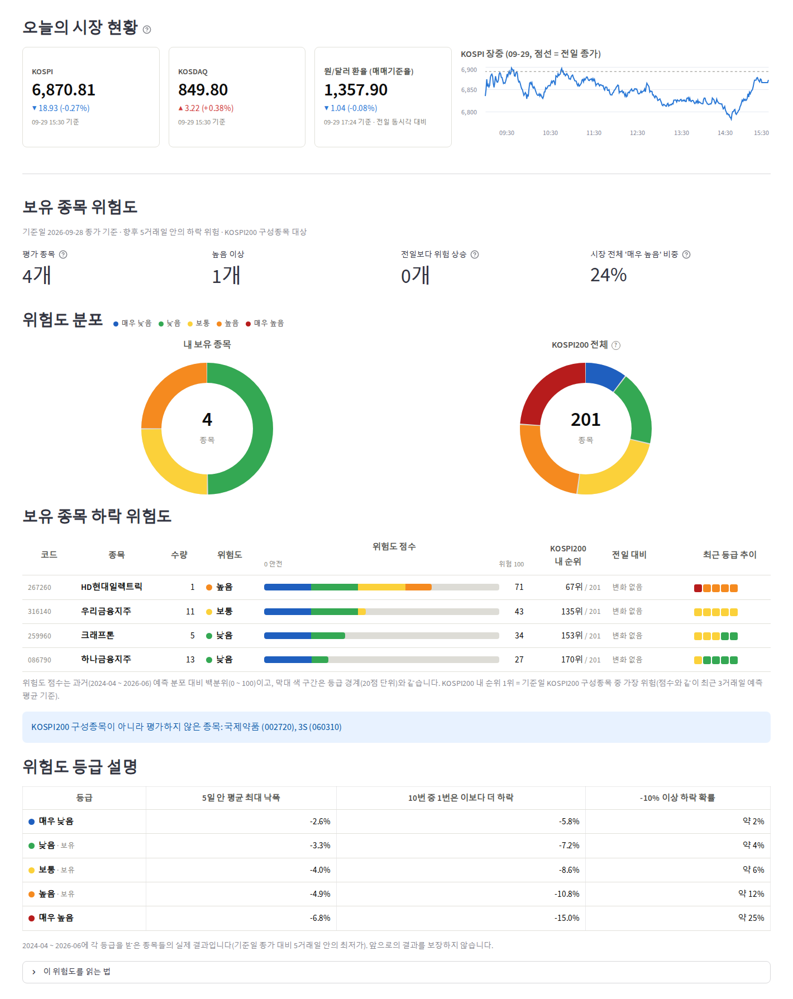

# stock-downside-risk

KOSPI200 종목의 **향후 5거래일 최대 낙폭(MDD_5)**을 예측해 종목별 **하락 위험도(0 ~ 100점, 5등급)**를 매기고, 보유 종목의 위험도를 보여 주는 Streamlit 대시보드입니다.



> 교육·연구용 프로젝트입니다. 위험도는 과거 데이터 기반 통계 추정이며 투자 권유가 아닙니다.

---

## 주요 내용

| 구분 | 내용 |
|---|---|
| 예측 대상 | `MDD_5 = min(저가[t+1 ~ t+5]) / 종가[t] − 1` (KRX 정규장 기준) |
| 예측 시점 | t+1일 장 시작 전. 변수는 t일 장 마감 후까지 확정된 정보만 사용 |
| 유니버스 | 날짜별 KOSPI200 구성종목(point-in-time) |
| 모델 | `VolResidModel`: 변동성 변수 3개로 낙폭 수준(Ridge) + 종목 간 차이 보정(LightGBM, 트리 100개) |
| 위험도 점수 | 예측 낙폭이 학습 기간 예측값 분포에서 차지하는 백분위(0 ~ 100). 최근 3거래일 예측 평균으로 계산 |
| 등급 | 20점 단위 5등급: 매우 낮음 · 낮음 · 보통 · 높음 · 매우 높음 |
| 기간 | 학습 2024-04 ~ 2026-06, 검증 2026-07 ~ 08(1회 평가) |

### 성능

| | 날짜별 IC | 풀링 Spearman |
|---|---:|---:|
| 교차검증(학습 구간, 표본 밖) | 0.339 | 0.321 |
| **검증 구간(2026-07 ~ 08)** | **0.456** | **0.340** |
| 베이스라인: 최근 5일 변동성(`gk_5`) 선형 | 0.427 | 0.268 |

- 등급이 높을수록 실제 낙폭이 컸습니다(검증 구간 실제 평균: 매우 낮음 -1.5% → 매우 높음 -7.5%, -10% 이상 하락 비율 0% → 27.8%).
- **한계**
  - 특정 날의 시장 급락은 미리 알려 주지 못합니다(날짜별 시장 수준 예측 불가).
  - 개별 종목의 "몇 % 하락" 수치는 오차가 커서(검증 평균 절대오차 4.1%p) 대시보드에 표시하지 않습니다.
  - KOSPI200 구성종목만 평가합니다.

자세한 내용은 [`outputs/model_report.md`](outputs/model_report.md)와 [`outputs/eda_report.md`](outputs/eda_report.md)에 있습니다.

---

## 대시보드

- **오늘의 시장 현황**: KOSPI · KOSDAQ 현재가, 원/달러 매매기준율, KOSPI 장중 1분봉(토스증권 Open API, 5분마다 자동 갱신)
- **보유 종목 위험도**: 요약 지표, 내 보유 종목과 KOSPI200 전체의 등급 분포(도넛)
- **보유 종목 하락 위험도**: 종목별 등급, 위험도 점수 막대, KOSPI200 내 순위, 전일 대비 변화, 최근 등급 추이
- **위험도 등급 설명**: 학습 기간에 각 등급이었던 종목들의 실제 결과(평균 낙폭, 하위 10% 낙폭, -10% 이상 하락 확률)
- 보유 종목 입력: 고객정보 DB에서 연령대별 고객 선택, 또는 직접 입력

---

## 폴더 구조

```
app/dashboard.py          Streamlit 대시보드
src/
  data.py, db.py          DB 조회(읽기 전용) + Parquet 캐시, 수집 데이터(data/live) 병합
  universe.py             KOSPI200 point-in-time 유니버스
  target.py               타깃(MDD_5) 계산
  features.py             변수 생성(가격·변동성·수급·신용·시장)
  modeling.py, scoring.py 모델, 교차검증, 점수·등급 변환
  daily_score.py          일별 위험도 점수·순위 산출
  collect.py              원천 데이터 일별 수집(KRX·토스증권 Open API)
  market_live.py          토스증권 Open API 클라이언트(실시간 시세·환율)
  holdings.py             고객 보유 종목 조회
  dashboard_data.py       대시보드용 데이터 가공
scripts/                  일별 수집 실행 스크립트, Windows 작업 스케줄러 정의
outputs/
  notebooks/              단계별 노트북(01 ~ 11)
  model/                  최종 모델, 점수 환산표, 등급표
  daily/                  일별 위험도 점수(CSV + 점검 JSON)
  eda_report.md, model_report.md
docs/                     진행 기록, EDA·모델링 계획
```

---

## 설치

```bash
conda create -n stock_risk python=3.11
conda activate stock_risk
pip install -r requirements.txt
```

프로젝트 루트에 `.env`를 만들고 아래 값을 채웁니다(저장소에는 포함되지 않습니다).

| 변수 | 용도 |
|---|---|
| `DB_HOST`, `DB_PORT`, `DB_NAME`, `DB_USER`, `DB_PASSWORD` | 시세·수급 MySQL DB(읽기 전용) |
| `CUSTOMER_DB_NAME` | (선택) 고객정보 데이터베이스 이름. 기본 `fintech_realistic_class` |
| `TOSS_CLIENT_ID`, `TOSS_CLIENT_SECRET` | [토스증권 Open API](https://developers.tossinvest.com/). 호출 IP를 허용 IP로 등록해야 합니다 |
| `TOSS_BASE_URL` | (선택) 기본 `https://openapi.tossinvest.com` |
| `KRX_KEY` | [KRX Data Marketplace Open API](https://openapi.krx.co.kr/) 인증키(유가증권 일별매매정보) |

---

## 실행

```bash
# 대시보드
streamlit run app/dashboard.py

# 특정 기준일의 위험도 점수 계산 → outputs/daily/risk_scores_<기준일>.csv
python -m src.daily_score --date 2026-09-28

# 원천 데이터 수집 + 점수 계산(마지막 수집일 ~ 어제의 거래일)
python -m src.collect --auto
python -m src.collect --start 2026-09-16 --end 2026-09-28   # 기간 지정
```

### 매일 자동 수집

- KRX 일별 데이터는 다음 날 아침에 게시되고, 신용거래는 다음 날 새벽에 확정됩니다. 그래서 **매일 09:00(재시도 11:00)**에 전 거래일을 수집합니다.
- Windows(WSL)에서는 작업 스케줄러에 등록합니다.
  ```
  schtasks /Create /TN "StockRisk\DailyCollect" /XML scripts\stock_risk_collect_task.xml
  ```
- 수집 데이터는 DB 테이블과 같은 이름·컬럼의 Parquet로 `data/live/`에 저장되고, 점수 계산 때 DB와 합쳐 읽습니다.
- 로그는 `logs/collect_YYYYMM.log`에 남습니다.

---

## 데이터 원천

| 데이터 | 원천 |
|---|---|
| KRX 정규장 일봉(수정주가, 거래대금, 상장주식수, 거래정지) | KRX Open API |
| 투자자별·기관 세부 매매, 프로그램 매매, 공매도, 신용, 대차, 통합(KRX+NXT) 거래량, 지수·국채 | 토스증권 Open API |
| KOSPI200 구성종목 월별 스냅샷, 종목 업종 | MySQL DB |

시세 데이터의 이용·재배포는 각 제공처의 약관을 따릅니다.

---

## 재현 순서

`outputs/notebooks/`의 노트북을 순서대로 실행합니다(커널: `stock_risk`).

1. `01 ~ 07`: EDA(스키마, 유니버스, 품질, 타깃, 변수, 관계, 요약), `03b`: KRX 일봉 검증
2. `08 ~ 10`: 데이터셋 구성, 모델 교차검증, 최종 모델·점수 환산표·등급표
3. `11`: 검증 구간 1회 평가

진행 기록과 확정된 결정은 [`docs/progress.md`](docs/progress.md)에 있습니다.
