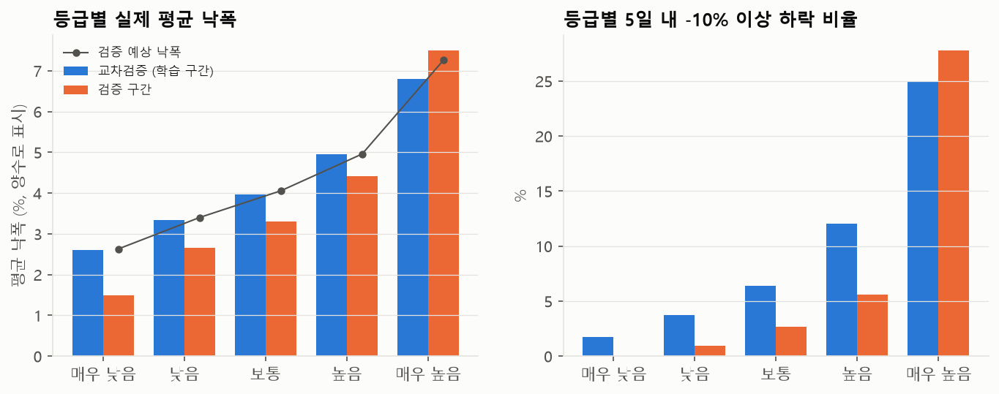
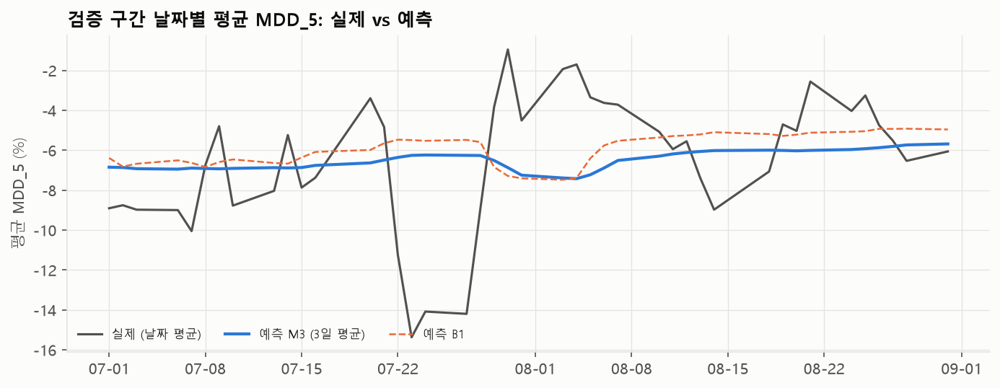

# 모델 리포트: KOSPI200 종목 위험도 점수 (MDD_5)

- 작성일: 2026-09-29
- 범위: 학습 2024-04-01 ~ 2026-06-30(교차검증, 모델 선택, 환산표), 검증 2026-07-01 ~ 2026-08-31(**1회 평가**)
- 재현: `outputs/notebooks/08_dataset.ipynb` ~ `11_validation.ipynb`(커널 `stock_risk`)
- 계획: `docs/modeling_plan.md`. EDA 결과: `outputs/eda_report.md`

---

## 0. 요약

1. **용도는 종목별 위험 등급 표시다.** "내일 폭락"을 알리는 경보가 아니다.
   - 출력: 예상 낙폭(%), 위험도 점수(0 ~ 100), 5등급
2. **모델은 M3(`VolResidModel`)다.** 변동성 변수 3개로 낙폭 수준을 잡고(Ridge), 같은 날 종목 간 차이를 LightGBM(트리 100개)으로 보정한다.
3. **검증 구간에서 종목 간 순위 성능이 유지됐다.** 오히려 교차검증보다 좋았다.
   - 날짜별 IC 0.458(교차검증 0.339), 풀링 Spearman 0.340(교차검증 0.321)
   - 베이스라인 B1(`gk_5` 선형)보다 낫다: 풀링 Spearman 0.340 vs 0.268
4. **등급은 검증 구간에서도 단조롭다.**
   - 실제 평균 낙폭: 매우 낮음 -1.5% → 매우 높음 -7.5%
   - -10% 이상 하락 비율: 0% → 27.8%
5. **검증 구간은 강한 충격 국면이었다.** KOSPI -19.5%, 일간 변동성은 학습 구간의 2.5배였다. 그래서 종목-일의 72%가 '매우 높음'을 받았다. 과거 대비 수준을 나타내는 D 방식의 의도된 동작이다.
6. **한계**
   - 날짜별 시장 수준(특정 날의 급락)은 예측하지 못한다. 검증 구간의 날짜 평균 상관은 -0.14다.
   - 이 국면에서 횡단면 보정(LightGBM)의 기여는 작았다. 순위 성능은 주로 변동성 부분에서 나왔다.

---

## 1. 문제 설정

| 항목 | 내용 |
|---|---|
| 타깃 | `mdd_low = min(Low[t+1..t+5]) / Close[t] − 1`(KRX 정규장, 연속값, 0 이하) |
| 예측 시점 | t+1일 장 시작 전. 변수는 t일까지의 정보(t일 장 마감 후 공표 수급 포함) |
| 유니버스 | 각 거래일의 KOSPI200 구성종목(point-in-time). 거래정지 관련 쌍은 뺀다 |
| 학습 표본 | 107,880쌍, 540거래일(2024-04-01 ~ 2026-06-23), 228종목. 학습 구간 마지막 5거래일은 엠바고로 뺐다 |
| 교차검증 | 거래일 5블록, 확장 창, 검증 블록 직전 5거래일 purge. 검증 fold는 블록 2 ~ 5 |
| 검증 표본 | 8,378쌍, 42거래일, 200종목(거래정지 관련 22쌍 제외) |

## 2. 모델 선택 (9단계, 교차검증)

| 모델 | 풀링 Spearman | 날짜별 IC | MAE |
|---|---:|---:|---:|
| B1 `gk_5` 선형 | 0.299 | 0.316 | 0.0299 |
| B2 변동성 3개 선형 | 0.311 | 0.323 | 0.0298 |
| M1 Ridge 전체 변수 | 0.227 | 0.334 | 0.0320 |
| M2 LightGBM 전체 변수 | 0.280 | 0.332 | 0.0324 |
| **M3 변동성 수준 + 횡단면 잔차 LightGBM** | **0.321** | **0.339** | **0.0296** |

- M3는 최종 설정(트리 100개) 기준이다. 전체 변수를 한 모델에 넣은 Ridge(M1)와 LightGBM(M2)은 fold마다 수준 예측이 불안정해서 풀링 성능이 떨어졌다.
- M3의 구조
  - 수준: `gk_5`, `idio_vol_60`, `ind_vol_20`(원래 값)으로 Ridge 회귀. 시장이 흔들려 변동성이 오르면 전 종목의 예측 낙폭이 함께 커진다.
  - 횡단면 보정: 수준 모델 잔차에서 날짜 평균을 뺀 값을, 종목 변수 22개의 날짜별 백분위 순위로 LightGBM 회귀. 보정값의 날짜 평균은 0이다.
- 상세: `outputs/model_cv_results.csv`, `09_model_cv.ipynb`

## 3. 점수와 등급 (10단계, 검증 평가 전 고정)

- **점수(D 방식)**: 예측 MDD_5가 최종 모델의 학습 구간 예측 분포에서 차지하는 백분위다. 환산표는 `outputs/model/score_reference.csv`(1001단계)다.
  - 기준점: 50점 = 예상 낙폭 -4.0%, 80점 = -5.4%, 90점 = -6.3%, 95점 = -7.2%, 99점 = -9.0%
  - 점수는 확률이 아니다. "90점 = 학습 기간 예측값 중 상위 10% 위험"이라는 뜻이다.
- **등급**: 5등급, 20점 단위(매우 낮음, 낮음, 보통, 높음, 매우 높음). 2026-09-29 확정
- **평활화**: 종목별 최근 3거래일 예측 MDD_5의 평균을 같은 환산표로 점수화한다. 2026-09-29 확정
  - 교차검증에서 성능 손실은 작고(풀링 Spearman 0.321 → 0.316), 하루 등급 변경 비율은 16%에서 11%로 줄었다.

**기준 등급표** (학습 구간 교차검증 예측, 3일 평균, `outputs/model/grade_table_s3.csv`)

| 등급 | 점수 | 예상 낙폭 | 실제 평균 | 실제 하위 10% | -10% 이상 하락 |
|---|---|---:|---:|---:|---:|
| 매우 낮음 | 0 ~ 20 | -2.5% | -2.6% | -5.8% | 1.7% |
| 낮음 | 20 ~ 40 | -3.3% | -3.3% | -7.2% | 3.7% |
| 보통 | 40 ~ 60 | -4.0% | -4.0% | -8.6% | 6.4% |
| 높음 | 60 ~ 80 | -4.9% | -5.0% | -10.8% | 12.1% |
| 매우 높음 | 80 ~ 100 | -6.5% | -6.8% | -15.0% | 25.0% |

## 4. 검증 구간 평가 (11단계, 1회)

### 4.1 절차

- 검증 데이터를 읽기 전에 등급 수와 평활화를 확정하고 기준 등급표를 저장했다.
- 변수와 타깃은 학습 때와 같은 함수로 2026-09-16까지 다시 만들었다. 다시 만든 학습 구간 값은 기존 캐시와 모두 같았다(변수 232개 × 121,261행, 타깃 107,880행).
- 저장된 모델과 환산표를 그대로 썼다. 결과를 보고 바꾼 것은 없다.
- 운영과 같게 각 날짜의 구성종목 전체로 예측했다. 7월 초의 3일 평균을 위해 6월 말 예측부터 계산했다.

### 4.2 시장 상황

| | 학습 구간 | 검증 구간 |
|---|---:|---:|
| KOSPI 일간 수익률 표준편차 | 2.1% | 5.1% |
| KOSPI 기간 수익률 | | -19.5% |
| 평균 MDD_5 | -4.3% | -6.5% |

검증 구간은 2026년 상반기 충격 이후에도 변동성이 매우 큰 국면이었다. 특히 7월 22 ~ 27일에는 날짜 평균 MDD_5가 -14 ~ -15%였다.

### 4.3 성능

| | 풀링 Spearman | 날짜별 IC | IC IR | 수준 상관 | 수준 편향 | MAE | 예측 상위 10%의 -10% 하락 비율 |
|---|---:|---:|---:|---:|---:|---:|---:|
| 교차검증 M3 (전체) | 0.321 | 0.339 | 1.78 | 0.42 | +0.1%p | 0.0296 | 31.2% |
| 교차검증 M3 (fold 5, 충격 국면) | 0.306 | 0.356 | 1.67 | 0.31 | +1.1%p | 0.0415 | 44.5% |
| **검증 M3 (3일 평균, 운영 설정)** | **0.340** | **0.456** | 1.49 | -0.14 | 0.0%p | 0.0412 | 41.3% |
| 검증 M3 (매일) | 0.340 | 0.458 | 1.51 | -0.14 | 0.0%p | 0.0411 | 41.1% |
| 검증 B1 `gk_5` 선형 | 0.268 | 0.427 | 1.49 | -0.16 | +0.6%p | 0.0415 | 37.6% |

- 수준 편향 = 예측 날짜 평균 − 실제 날짜 평균(양수면 낙폭을 작게 예측)
- **종목 간 순위**
  - 날짜별 IC는 교차검증보다 높다. 7월 0.56, 8월 0.34이고, IC가 양수인 날은 88%다.
  - 변동성이 큰 국면일수록 종목 간 변동성 차이가 낙폭 차이로 잘 이어져 IC가 높아진다(fold 5도 전체보다 높았다).
- **B1 대비**: IC 차이(0.456 vs 0.427)보다 풀링 Spearman 차이(0.340 vs 0.268)가 크다. M3의 수준 부분(변동성 3개)이 종목과 국면의 위험 수준을 더 잘 잡는다.
- **3일 평균**은 성능을 거의 바꾸지 않았다.

### 4.4 등급별 결과 (3일 평균 점수)

| 등급 | 비중(교차검증) | 비중(검증) | 예상 낙폭 | 실제 평균 | 실제 하위 10% | -10% 이상 하락 | n |
|---|---:|---:|---:|---:|---:|---:|---:|
| 매우 낮음 | 20.8% | 0.7% | -2.6% | -1.5% | -2.7% | 0.0% | 61 |
| 낮음 | 19.8% | 2.5% | -3.4% | -2.7% | -5.0% | 1.0% | 206 |
| 보통 | 19.3% | 7.6% | -4.1% | -3.3% | -6.8% | 2.7% | 634 |
| 높음 | 20.0% | 17.0% | -5.0% | -4.4% | -8.7% | 5.6% | 1,426 |
| 매우 높음 | 20.1% | 72.2% | -7.3% | -7.5% | -16.1% | 27.8% | 6,051 |

- **단조성**: 등급이 오를수록 모든 지표가 나빠진다. 검증 구간 내부 10분위로 나눠도 실제 평균 낙폭은 -3.0%에서 -9.3%로 단조롭게 커진다.
- **분포 쏠림**: 종목-일의 72%가 '매우 높음'이다(7월 78%, 8월 65%). 점수가 과거 대비 위험 수준이기 때문이다. 이 국면에서는 등급만으로 종목을 구분하기 어렵다. 같은 등급 안에서는 점수나 예상 낙폭으로 비교해야 한다.
- **낮은 등급은 위험을 과대평가했다.** 매우 낮음 ~ 높음 등급의 실제 평균 낙폭은 예상보다 0.5 ~ 1.1%p 작다. '매우 높음'은 실제(-7.5%)가 예상(-7.3%)보다 조금 크다. 실제 종목 간 차이가 예측보다 더 벌어졌다는 뜻이다.

### 4.5 날짜별 수준

- 기간 평균은 맞았다(예측 -6.5%, 실제 -6.5%). 하지만 날짜별로는 따라가지 못했다(상관 -0.14).
- 예측의 날짜 평균은 -6 ~ -7.5%에서 완만하게 움직였다. 7월 22 ~ 27일 급락(-14 ~ -15%)과 7월 말 반등(-1 ~ -2%)은 반영하지 못했다.
- EDA와 교차검증에서 이미 확인한 한계다. 날짜 공통 요인(분산의 약 40%)을 예측하는 시장 변수는 찾지 못했다.

### 4.6 모델 부분별 기여

| 부분 | 날짜별 IC (검증) |
|---|---:|
| 수준(변동성 Ridge) | 0.447 |
| 횡단면 보정(LightGBM) 단독 | -0.037 |
| 합계(M3) | 0.458 |

- 순위 성능은 대부분 변동성 부분에서 나왔다. 보정값만으로는 순위를 맞추지 못했지만, 더하면 IC가 0.011 오른다.
- 교차검증에서는 보정 부분이 B2 대비 성능 향상의 주된 원천이었다. 충격 국면에서는 하방 특성·수급 같은 보조 변수의 효과가 약해진 것으로 보인다. 평온한 국면에서 다시 확인해야 한다.

### 4.7 등급 안정성

| | 매일 | 3일 평균 |
|---|---:|---:|
| 하루 등급 변경 비율 | 8.0% | 5.3% |
| 2등급 이상 변경 | 0.16% | 0% |

검증 구간은 대부분 '매우 높음'에 머물러 교차검증(16% → 11%)보다 변경 비율이 낮다.

## 5. 결론과 운영 시 주의점

- **결론**: M3 + D 점수 + 5등급 + 3일 평균을 최종 설정으로 유지한다. 검증 구간에서 종목 간 순위와 등급 단조성이 확인됐고, B1보다 낫다.
- **화면에 함께 둘 설명**
  - 점수는 과거(2024-04 ~ 2026-06) 대비 위험 수준이다. 시장 전체가 불안하면 대부분 종목이 높은 등급을 받는다.
  - 점수는 특정 날의 시장 급락을 미리 알리지 않는다. 변동성이 오른 뒤에 따라 올라간다.
  - 예상 낙폭은 평균적인 5일 최대 낙폭이다. '매우 높음' 등급에서도 하위 10%는 -15% 이상 떨어졌다.
- **오늘 종목 간 순위 (2026-09-29 추가)**: 점수는 그대로 두고, 같은 날 구성종목 중 순위(1 = 가장 위험, 3일 평균 예측 기준)를 함께 보여 준다. '매우 높음'이 몰리는 국면에서도 종목을 구분할 수 있다. 산출: `python -m src.daily_score --date YYYY-MM-DD` → `outputs/daily/risk_scores_<기준일>.csv`
- **모니터링 제안**
  - 날짜별 IC와 등급별 실제 낙폭을 월 단위로 기록한다.
  - 평온한 국면이 오면 횡단면 보정(LightGBM)의 기여를 다시 점검한다.
  - 재학습 시에는 검증 구간을 학습에 넣고 환산표를 다시 만든다. 환산표가 바뀌면 같은 예측값의 점수도 바뀐다.

## 6. 산출물

| 경로 | 내용 |
|---|---|
| `outputs/model/vol_resid_model.joblib` | 최종 모델 |
| `outputs/model/score_reference.csv` | 점수 ↔ 예상 낙폭 환산표 |
| `outputs/model/grade_table_s3.csv` | 기준 등급표(교차검증, 3일 평균). `grade_table.csv`는 매일 점수 기준 |
| `outputs/model/model_meta.json` | 변수, 파라미터, 기간, 평활화 설정 |
| `data/cache/validation_predictions.parquet` | 검증 구간 예측(수준, 보정, 예측, 3일 평균, 점수, 등급) |
| `outputs/notebooks/11_validation.ipynb` | 검증 평가 노트북 |
